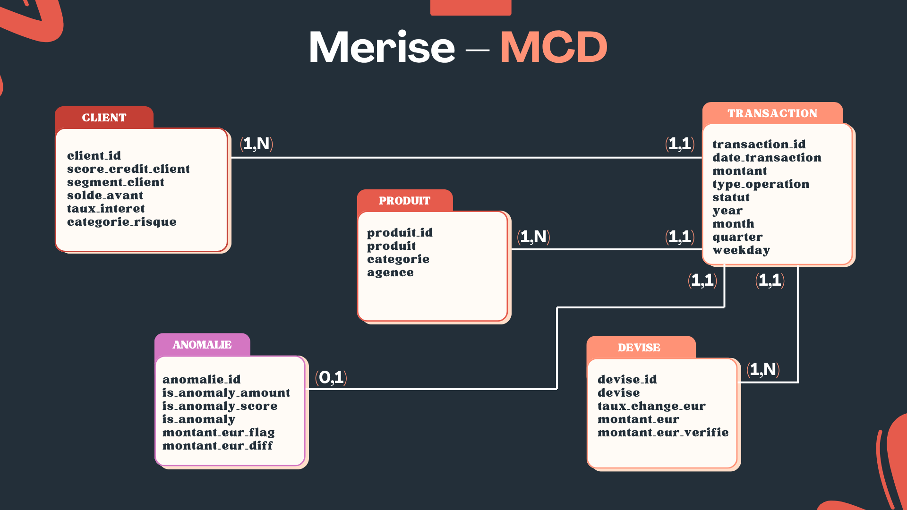
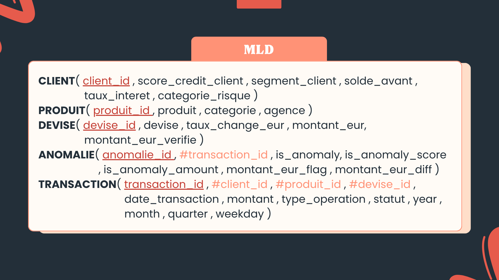
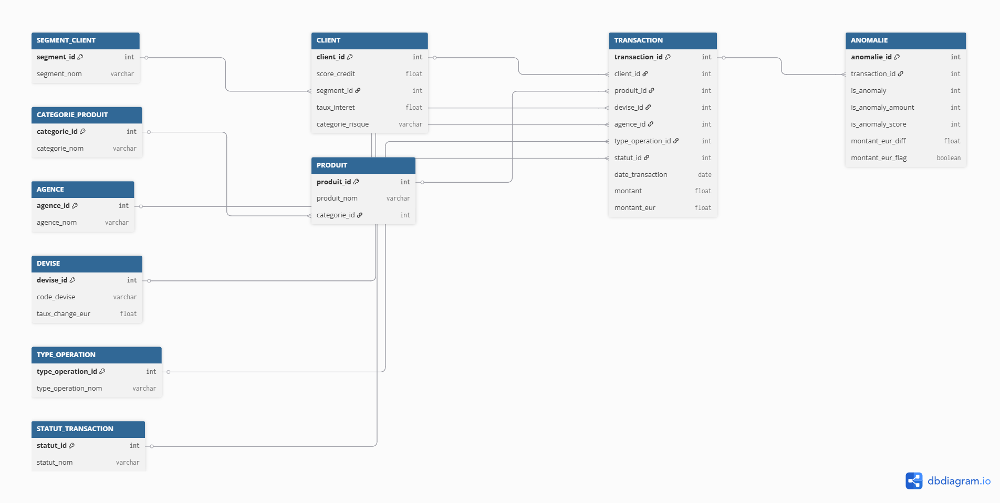
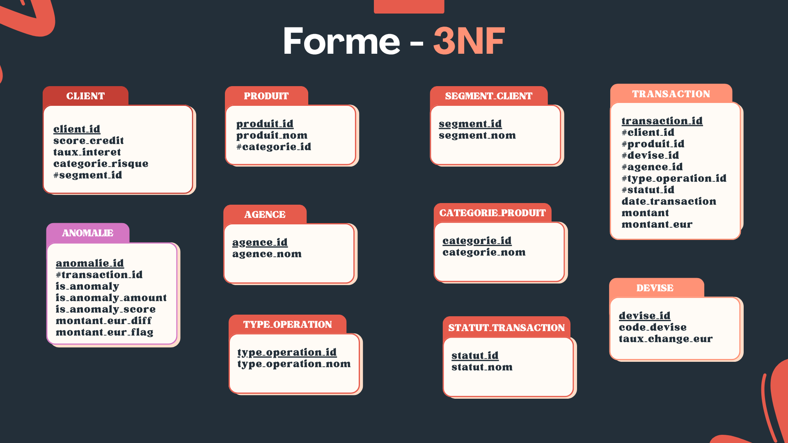

# FinanceCore Data Engineering & Analytics

[](https://www.python.org/)
[](https://www.postgresql.org/)
[](https://pandas.pydata.org/)
[](https://www.sqlalchemy.org/)

FinanceCore is a comprehensive data engineering project that simulates a robust financial data infrastructure. It focuses on the end-to-end process of transforming raw transaction data into a structured, normalized relational database optimized for security analytics and financial KPIs.

---

## 📊 Database Design & Modeling

The project architecture is built on formal data modeling principles, ensuring integrity and scalability.

### 1. Merise Modeling (MCD & MLD)
We started with a conceptual approach to define business entities and their relationships.

| Model | Image |
| :--- | :--- |
| **Conceptual Data Model (MCD)** |  |
| **Logical Data Model (MLD)** |  |

### 2. Entity-Relationship Diagram (ERD)
The final physical schema designed in `dbdiagram.io`, showing primary/foreign keys and constraints.



### 3. Normalization (3NF)
Data is strictly normalized to the **Third Normal Form (3NF)** to eliminate redundancy and improve performance.



---

## 🏗️ Project Architecture

```bash
financecore_postgres_analytics
├── asset/                   # Technical diagrams (MCD, MML, ERD)
├── config/
│   └── db_config.py         # SQLAlchemy engine & .env loader
├── data/
│   └── financecore_clean.csv # Raw dataset
├── data_processing/
│   ├── data_cleaning.py     # Pre-processing & type casting
│   ├── etl_pipeline.py      # Schema mapping & splitting
│   └── load_data.py         # DB insertion logic
├── docs/                    # Additional documentation (empty)
├── json_planification/      # Project management & Jira mapping
├── logs/                    # Execution logs (etl.log)
├── notebooks/               # Data exploration & prototyping
├── scripts/
│   ├── run_etl.py           # Main ETL execution script
│   └── run_analytics.py     # Database validation script
├── sql/
│   ├── 01_create_database.sql
│   ├── 02_create_tables.sql # DDL with constraints
│   ├── 03_indexes.sql       # Performance tuning
│   ├── 04_views.sql         # Analytical views
│   └── 05_analytics_queries.sql
├── venv/                    # Virtual environment (ignored)
├── .env.example             # Template for credentials
├── .gitignore
└── requirements.txt         # Project dependencies
```

---

## 🚀 Quick Start Guide

### 1. Environment Setup
Clone the repository and create a virtual environment:

```bash
# Create venv
python -m venv venv

# Activate venv (Windows)
.\venv\Scripts\activate

# Install dependencies
pip install -r requirements.txt
```

### 2. Database Configuration
Create a `.env` file in the root directory with your PostgreSQL credentials:

```ini
DB_USER=your_user
DB_PASSWORD=your_password
DB_HOST=localhost
DB_PORT=5432
DB_NAME=financecore_db
```

### 3. Running the Pipeline
The `run_etl.py` script automates everything: it initializes the schema, cleans the data, splits it into normalized tables, and loads it into PostgreSQL.

```bash
python scripts/run_etl.py
```

---

## 🧪 Data Validation & Analytics

Once the ETL is finished, you can verify the data consistency and run analytical reports.

### Verify Table Counts
```bash
python scripts/run_analytics.py
```

### Analytical Views
The database includes pre-defined views for business intelligence:
- **`v_transactions_details`**: Full transaction history with human-readable labels.
- **`v_transactions_anomalies`**: Filtered list of detected financial anomalies.
- **`v_kpi_global`**: Aggregated totals and averages.
- **`v_kpi_agence`**: Performance metrics per branch.

---

## 🛠️ Technology Stack
- **Engine**: Python 3.13
- **Database**: PostgreSQL
- **ORM/Driver**: SQLAlchemy & Psycopg
- **Data Analysis**: Pandas
- **Environment**: python-dotenv

---

## 📌 Future Improvements
- [ ] Integration with a Dashboard with Streamlit.
